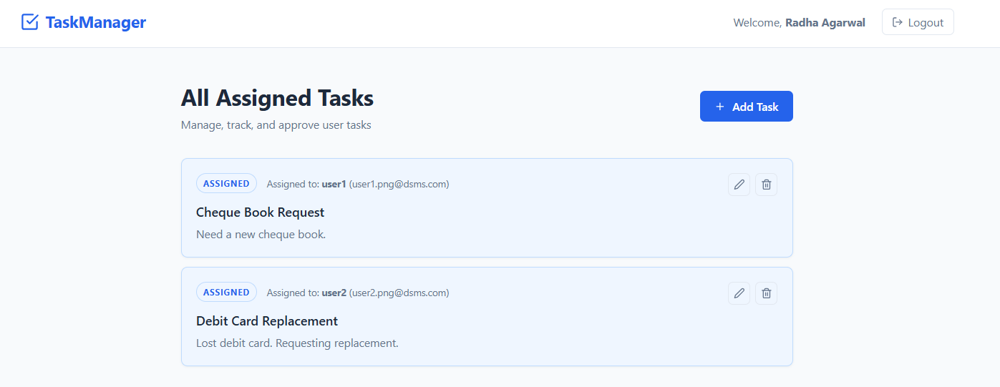
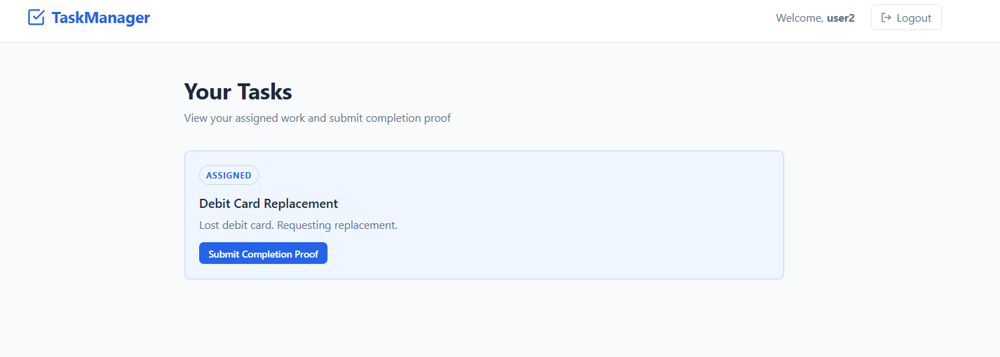
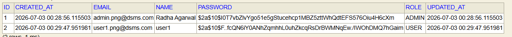
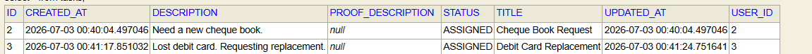
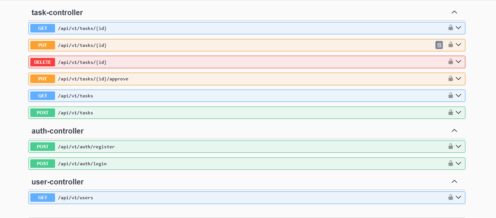

# Task Management System

A robust and secure Task Management System featuring a React frontend and Spring Boot REST API. This system implements a user assignment and approval workflow, using Spring Security, JWT tokens, and role-based permissions (USER and ADMIN) to manage tasks securely.

---

## Features

### 1. User & Admin Roles
- **ADMIN**: Can create tasks, assign them to specific users, view all tasks, and approve completed tasks.
- **USER**: Can view only their assigned tasks, write work descriptions, and submit proof of completion.

### 2. Status & Approval Workflow
- When an Admin creates a task, its status starts as `ASSIGNED`.
- A User submits completion proof (with a description), changing the task status to `PENDING_APPROVAL`.
- An Admin reviews the submitted proof on their dashboard and approves it, updating the task status to `COMPLETED`.

---

## Project Screenshots

### Admin Dashboard (Assigning and Reviewing Tasks)


### User Dashboard (Viewing Assigned Tasks & Submitting Proof)


### User / Admin Role Select


### Task Details View


### Swagger API Documentation


---

## Tech Stack

- **Frontend**: React 19 (Vite), Axios, Context API, CSS Modules / Vanilla CSS, React Icons
- **Backend Framework**: Spring Boot 3.5.16
- **Security**: Spring Security (JWT Bearer Token Authentication)
- **Database**: MySQL / H2 (In-memory database fallback)
- **ORM / Data Access**: Spring Data JPA / Hibernate
- **API Documentation**: Springdoc OpenAPI / Swagger UI
- **Build Tool**: Maven

---

## Folder Structure

```
├── frontend                        # React Frontend App
│   ├── src
│   │   ├── components              # TaskCard, TaskList, Navbar, ProtectedRoute
│   │   ├── context                 # AuthContext (state, register, login, logout)
│   │   ├── pages                   # Login, Register, Dashboard, AddTask, EditTask
│   │   └── services                # Axios configs & API base interceptor
├── src                             # Spring Boot Backend App
│   ├── main
│   │   ├── java/com/task/manager
│   │   │   ├── config              # SecurityConfig (CORS, H2 permit, state configurations)
│   │   │   ├── controller          # AuthController, TaskController, UserController
│   │   │   ├── dto                 # Request & Response DTOs
│   │   │   ├── entity              # User, Task JPA entities & TaskStatus/Role Enums
│   │   │   ├── repository          # UserRepository, TaskRepository
│   │   │   └── service             # AuthService, TaskService interfaces & impl
│   │   └── resources
│   │       └── application.properties # Server database profiles (MySQL / H2 settings)
```

---

## Setup & Run Instructions

### 1. Prerequisites
- **Java JDK 17** or higher.
- **Node.js** (for running the React frontend).
- **Maven** (or use the included Maven wrapper `./mvnw`).
- **MySQL Server** (optional, fallback to H2 is available).

### 2. Database Configuration
Open [application.properties](file:///c:/Users/HP/Downloads/manager/manager/src/main/resources/application.properties) to select your database:

#### Option A: In-Memory H2 Database (Instant setup)
Uncomment the H2 configurations and comment out the MySQL settings:
```properties
spring.datasource.url=jdbc:h2:mem:task_manager;DB_CLOSE_DELAY=-1;MODE=MySQL
spring.datasource.username=sa
spring.datasource.password=
spring.datasource.driver-class-name=org.h2.Driver
spring.jpa.database-platform=org.hibernate.dialect.H2Dialect
spring.h2.console.enabled=true
```

#### Option B: MySQL Database
Create your schema in MySQL:
```sql
CREATE DATABASE task_manager;
```
Then configure the properties in [application.properties](file:///c:/Users/HP/Downloads/manager/manager/src/main/resources/application.properties):
```properties
spring.datasource.url=jdbc:mysql://localhost:3306/task_manager
spring.datasource.username=YOUR_USERNAME
spring.datasource.password=YOUR_PASSWORD
spring.datasource.driver-class-name=com.mysql.cj.jdbc.Driver
```

---

### 3. Running the Backend
In the project root, start the server using Maven:
```bash
./mvnw clean spring-boot:run
```
The backend server runs at `http://localhost:8080`.

---

### 4. Running the Frontend
In another terminal, navigate to the `frontend` folder:
```bash
cd frontend
npm install
npm run dev
```
Open your browser at **`http://localhost:5173`** to access the web app.

---

## API Endpoints List

### Authentication Endpoints
- `POST` `/api/v1/auth/register`: Register user/admin with corresponding roles.
- `POST` `/api/v1/auth/login`: Authenticate and return JWT token.

### User Endpoints
- `GET` `/api/v1/users`: Retrieve all registered users (for Admin assignment dropdown).

### Task Endpoints
- `GET` `/api/v1/tasks`: Get all tasks (Admins see all tasks; Users see only tasks assigned to them).
- `GET` `/api/v1/tasks/{id}`: View a specific task.
- `POST` `/api/v1/tasks`: Create and assign a task to a user ID (`ADMIN` only).
- `PUT` `/api/v1/tasks/{id}`: Edit a task / Submit proof of completion.
- `PUT` `/api/v1/tasks/{id}/approve`: Approve task completion (`ADMIN` only).
- `DELETE` `/api/v1/tasks/{id}`: Delete a task (`ADMIN` only).

---

## Swagger Documentation
Interactive API docs are available at:
**`http://localhost:8080/swagger-ui/index.html`**

---

## H2 Console URL
If using the H2 database, you can view the live console at:
**`http://localhost:8080/h2-console`**
- **JDBC URL**: `jdbc:h2:mem:task_manager`
- **Username**: `sa`
- **Password**: *(leave blank)*
